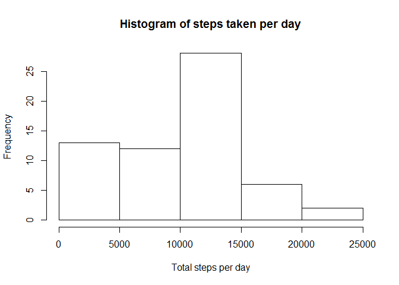

# Reproducible Research: Peer Assessment 1


## Loading and preprocessing the data

```r
activity = read.csv("activity/activity.csv")
activity_complete = activity[complete.cases(activity),]
```

## What is mean total number of steps taken per day?

```r
steps_per_day = ddply(activity_complete, c("date"), summarize, total_steps = sum(steps))
hist(steps_per_day$total_steps, main = "Histogram of steps taken per day", xlab = "Total steps per day")
```

 

```r
avg_steps_per_day = mean(steps_per_day$total_steps)
median_steps_per_day = median(steps_per_day$total_steps)
```
Average total number of steps taken per day is 10766.2.
The median is 10765 steps.

## What is the average daily activity pattern?

```r
steps_per_interval = ddply(activity_complete, c("interval"), summarize, avg_steps = mean(steps))
with(steps_per_interval, plot(interval, avg_steps, type = "l"))
```

 

```r
max_steps_per_interval = steps_per_interval[which.max(steps_per_interval$avg_steps), ]
```

The most steps (on average ``206.2``) were taken at interval ``835``

## Imputing missing values
Because in the steps column we can find "NA" values, we will compute average of steps per day and replace NA with average for that day.
However, if the average for the day is NA as well, we will take zero if that's the case.

```r
count_of_missing_data = nrow(activity) - nrow(activity_complete)
avg_steps_per_day = ddply(activity_complete, c("date"), summarize, avg_steps = mean(steps))
merged_activity_with_avg = merge(activity, avg_steps_per_day, by = "date", all.x = TRUE)
# put zeroes in place on NA avg per day:
merged_activity_with_avg$avg_steps[is.na(merged_activity_with_avg$avg_steps)] <- 0
# and now use avg per day as the steps in interval if it was NA in the first place
merged_activity_with_avg$steps[is.na(merged_activity_with_avg$steps)] <- merged_activity_with_avg$avg_steps[is.na(merged_activity_with_avg$steps)]

# remove excessive column to get back to original format
activity_with_avg = merged_activity_with_avg[,c("steps", "date", "interval")]

# perform a formatting as in earlier graph (consider creating a function for this)
steps_per_day = ddply(activity_with_avg, c("date"), summarize, total_steps = sum(steps))
hist(steps_per_day$total_steps, main = "Histogram of steps taken per day", xlab = "Total steps per day")
```

 

```r
avg_steps_per_day = mean(steps_per_day$total_steps)
rounded_avg_steps_per_day = round(avg_steps_per_day, 0)
median_steps_per_day = median(steps_per_day$total_steps)
```
There are ``2304`` rows that are missing original data.
After filling in NAs with zeroes (it turns out that all of the NAs apply to complete days), the **new average total number of steps taken per day is 9354.
The median is 10395 steps.**

It basically treats a day without any log as a day with 0 steps taken. Because of this, **both the average and the median are lower than without filling in missing values**. But it is unreasonable to assume that missing days are equivalent to days with zero steps. A different approach might be considered (take an average from day before and day after) - however this average would not work for weekends for instance.

## Are there differences in activity patterns between weekdays and weekends?

```r
isWeekend <- function(date) {
  as.POSIXlt(date,format="%Y-%m-%d")$wday == 0 || as.POSIXlt(date,format="%Y-%m-%d")$wday == 6
}

activity_complete$weekend <- factor(x = sapply(activity_complete$date, isWeekend), levels = c(FALSE, TRUE), labels = c("weekday", "weekend"))

steps_per_interval = ddply(activity_complete, c("weekend", "interval"), summarize, avg_steps = mean(steps))

qplot(interval, avg_steps, data = steps_per_interval, geom  =	c("line"), ylab = "Number of steps")	+ facet_wrap(~ weekend,nrow=2) 
```

 
